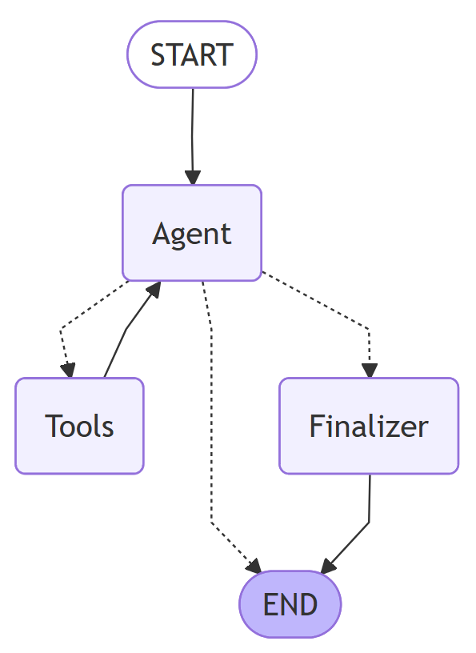

# 🐧 GNU Coreutils AI Navigator


**An autonomous AI agent for navigating, analyzing, and explaining the GNU Coreutils C codebase.**

The **Coreutils AI Navigator** is an agentic AI application. It leverages a **ReAct (Reason + Act)** workflow to trace function calls, inspect structs, and synthesize explanations for legacy system code.

---

## 🚀 Key Features

* **LLM used:** OpenAI GPT-OSS-20B (finetuned for code reasoning tasks).
* **Embedding model:** Hugging Face SentenceTransformer model (all-mpnet-base-v2).
* **Codebase:** GNU Coreutils C source code (over 500,000 lines of code).
* **Orchestration framework:** Langgraph and Langchain.
* **Monitoring:** Integrated with LangSmith for trace analysis, latency monitoring, and cost tracking.
* **Production Guardrails:**
    * **Topic Filtering:** Rejects unrelated queries (e.g., cooking recipes) before execution.
    * **Loop Protection:** Hard limits on reasoning steps to prevent infinite loops and cost overruns.
* **Resilient UI:** Streamlit interface with persistent thread memory and real-time thought process visualization.
* **Vector Database:** FAISS for efficient retrieval of relevant code snippets.
* **Providers:** Embedding models from Hugging Face & LLMs from Groq.

## Code Extraction and Storing in Vector DB

**python-tree-sitter** is used to parse the GNU Coreutils C codebase to extract functions. These extracted components are then stored in a FAISS vector database after generating embeddings using Hugging Face models. Query schema is defined in [./utils/query_schema.py].

### Struct Extraction:

```python
(struct_specifier
    name: (type_identifier)? @struct_name
    body: (field_declaration_list)
) @struct
```
- **Target Node:** struct_specifier
- **Captures:**
    - `@struct_name`: Name of the struct. The _?_ indicates this is optional (handles anonymous structs).
    - `@struct`: Captures the entire struct definition node, including the keyword `struct`, the name, and the body.

### Enum Extraction:

```python
(enum_specifier
    name: (type_identifier)? @enum_name
    body: (enumerator_list)
) @enum
```

- **Target Node:** enum_specifier
- **Captures:**
    - `@enum_name`: Name of the enum. The _?_ indicates this is optional (handles anonymous enums).
    - `@enum`: Captures the entire enum definition node, including the keyword `enum`, the name, and the body.

### Function Extraction:

```python
(function_definition
    declarator: [
        (function_declarator
           declarator: (identifier) @func_name)
        (pointer_declarator
           declarator: (function_declarator
               declarator: (identifier) @func_name))
    ]
    body: (compound_statement
        (expression_statement
            (call_expression
                function: (identifier) @called_func
            )
        )*
    )
) @func_body
```
- **Target Node:** function_definition
- **Declarator Logic:**
    - Used to capture function of both regular `int main(...)` and pointer function declarations `char *get_name(...)`.
- **Captures:**
    - `@func_name`: Name of the function being defined.
    - `@called_func`: Names of functions that are called within the body of the function.
    - `@func_body`: Captures the entire function definition node, including the return type, name, parameters, and body.

### Comment Extraction:

```python
(comment) @comments
```

- **Target Node:** comment
- **Captures:**
    - `@comments`: Captures all single-line and multi-line comments in the code.


## 🛠️ Architecture

The application is built on the **LangGraph** framework, utilizing a directed cyclic graph (DAG) to manage state.



- _START_: The entry point where the user's query initializes the state graph.
- _Agent_: The central reasoning engine (LLM) that analyzes the state and decides whether to call a tool or finish.
- _Tools_: The execution node that runs the retrieval functions and passes results back to the Agent.
- _Finalizer_: A safety node that forces a summary response if the Agent exceeds the maximum number of allowed loop steps (considered 5 in this case).
- _END_: The termination point where the workflow stops and returns the final answer to the application.

## Tools [./utils/tools.py]:

- **search_concepts**: It performs semantic similarity searches across high-level documentation (READMEs) and inline developer comments. It is best used for answering questions about software behavior, design philosophy, or error handling logic without needing to read raw C code. It retrieves most similar documents with respect to the query from the vector database storing READMEs[./vector_db_index/coreutils_index_readmes] and comments[./vector_db_index/coreutils_index_comments].

- **search_implementations**: It retrieves the actual source code definitions for C functions, structs, and enums. It is ideal for deep dives into specific implementations, understanding function interactions, and tracing data structures within the codebase. It retrieves most similar documents with respect to the query from the vector database storing functions, structs and enums [./vector_db_index/coreutils_index_functions_structs_enums].

## Installation and setup 

### Clone the repository
```bash
git clone https://github.com/dhruvroytalukdar/Coreutils-AI-navigator.git
cd Coreutils-AI-navigator
```

### Create and activate a virtual environment and install dependencies
```bash
uv init .
uv pip install -r pyproject.toml
```

### Secrets Setup
Create a `.env` file in the root directory and paste the contents.

### Run the Streamlit application
```bash
streamlit run reAct_agent.py
```

## Prompts for the AI Agent

- Data Summarizer
```text
    You are a Data Architect analyzing legacy COBOL systems.
    Analyze the following COBOL Data Structure (Data Layout or Linkage Section).   
    Your GOAL:
    Extract name of the data layout or linkage section, understand and summarize 2-3 line description about the section and extract important keywords from the section.
    COBOL CODE:
    {cobol_code}
```
- Code Summarizer
```text
    You are a Mainframe Modernization Architect. Your goal is to generate a search-optimized summary for the following COBOL code segment.
    
    Analyze the provided COBOL code segment. 
    Extract the business intent, technical action, and search specific keywords.
    
    Rules:
    1. Do not simply describe the syntax (e.g., avoid "Moves A to B").
    2. Identify specific CICS commands (SEND MAP, LINK) or SQL operations (SELECT, UPDATE).
    3. If the code handles errors (SQLCODE != 0), explicitly mention "Error Handling".
    4. Keep the "business_intent" explanative (2-3 sentences).
    
    COBOL CODE:
    {code_content}
    
    
    SUMMARY:
```
- Agent Node System Prompt
```text
    You are an expert COBOL technical assistant analyzing the CICS-Genapp COBOL library **ONLY**.
    To understand high-level behavior, search for documentation and developer comments, use 'search_concepts'.
    To search for COBOL code, procedures, sections use 'search_implementations'.
    If the user asks about ANY topic unrelated to CICS-Genapp, COBOL programming you must:
    1. REFUSE to answer.
    2. State clearly: 'I can only assist with CICS-Genapp and related system programming topics.'
    3. DO NOT try to be helpful or provide a 'brief' answer to the off-topic query.
    If you are **UNSURE** or **UNABLE TO ANSWER**, output the final answer **immediately** or specify 'I cannot help you with this query'.
    The user may ask wrong or misleading questions. Always provide the correct information.
    Do not double-check your work. Be decisive.
    Keep your responses concise and to the point and make sure the response is human understandable.
    Always cite the file name when explaining logic.
```

- Finalizer node prompt
```text
    "SYSTEM NOTICE: You have reached the maximum number of reasoning steps. "
    "Stop using tools immediately. "
    "Summarize the information you have gathered so far to answer the user's question. "
    "If you don't have the full answer, explain what you found and what is missing."
```


## AI Prompts I used to develop the project

### Prompts for ANTLR parser setup and Java code extractor

* I am trying to use proleap cobol parser to parse cobol files in cics-genapp. provide me some starter code to parse cobol code.
* I am trying to parse the above .cbl file using the above setup but i am getting the below error
"Is FIXED the correct line format (Columns 1-6 sequence number, column 7 indicator area, columns 8-72 for areas A and B)? Could not parse line 58: ENT1HNM DFHMDF POS=(08,50),LENGTH=20,ATTRB=(NORM,UNPROT,FSET),         X". The thing is i am skipping the copybooks entirely and the above statement is not even present in the file still i am getting this message.
* Still I am getting this error "io.proleap.cobol.preprocessor.exception.CobolPreprocessorException: Could not find copy book SSMAP in directory of COBOL input file or copy books param object." Explain the error.
* How to run the Java File having my parser? Note I am not using Eclipse.
* Now I want to parse the cobol files, extract important code segments and store them in vector database. later on i want to extract important code segments based on user query using langchain and langgraph in python. So tell me how i can extract cobol code segments and build the vectorbase. Can I use the python environment entirely for handling the vector database and somehow pass the data to it using Java.
* Say i want to learn in details about the apis or antlr library for cobol. suggest me articles which I can read to learn more about it.
* why did we make the CodeSegment class static? Explain in simple terms and in short.
* Explain in details what is happening in the below line segments. Explain all alternative arguments which can be useful in other scenarios with full explanations.
* Tell me what is happening in the below code
`ProcedureDivision pd = program.getCompilationUnits().get(0).getProgramUnit().getProcedureDivision();`
* I wrote a java code to scan all cobol files in a directory extract paragraph and store that in a json file. I am using multiple threads and i think the global "segments" list needed to be protected by locks. Tell me how to protect the list from data race in Java.
* can you tell me why the above paragraph is parsed as the below text in the code that you suggested. And why does it contain symbols like \u0027, and there is `END-EXEC }` suddenly although there is no `}` in the code, words in a sentence do not have spaces in between how to introduce spaces? 

`MOVE\u0027 DELETE POLICY  \u0027TOEM-SQLREQ\n*\u003eEXECSQL EXEC SQL\r*\u003eEXECSQL DELETE\r*\u003eEXECSQL FROM POLICY\r*\u003eEXECSQL WHERE ( CUSTOMERNUMBER \u003d :DB2-CUSTOMERNUM-INT AND\r*\u003eEXECSQL POLICYNUMBER  \u003d :DB2-POLICYNUM-INT      )\r*\u003eEXECSQL END-EXEC }\nIFSQLCODENOTEQUAL0ThenMOVE\u002790\u0027TOCA-RETURN-CODEPERFORMWRITE-ERROR-MESSAGE*\u003eEXECCICS EXEC CICS RETURN END-EXEC }END-IF\nEXIT\n`
* Why is there a end curly brace after `END-EXEC }\r\n`?
* Another thing i was thinking about instead of storing the cobol code as a whole in the vector database what if we store human readable text summary of what the code does into the vector databased which i can generate from some LLM by sending the code segment. The retrieval can then work on the summary text which will be easier to match with user query which will be in natural language as well. We can store the code segment as metadata and inject it into the prompt of the actual algorithm after retrieval using the natural language summary. For now I can use local llm tools like ollama to generate the summary.
* What exactly is stored in the linkage section in COBOL and is it relevant to store its contents in vector database?
* How to extract grouped data records in COBOL?


### Prompts for changes in the AI agent code in python
* Write me a better prompt for generating summary of COBOL code segments which will be good for vector search task as well.
* how to retrieve content from ollama strictly in json formatting, enforcing strict formatting like using pydantic or typing in python.
* will it be a good idea to insert JSON in the vector database? Isn't the primary reason we are storing summary as plain natural text is to facilitate vector similarity search using natural language as user query is also natural language.
* Provide some good resouces on pydantic and should I know if I am starting from zero.
* Give me some sample queries on the cics genapp repository to test my chatbot. The queries should test the agents understanding of the COBOL code and its ability to answer relevantly.
* Generate informative doc string for my below pydantic class.

